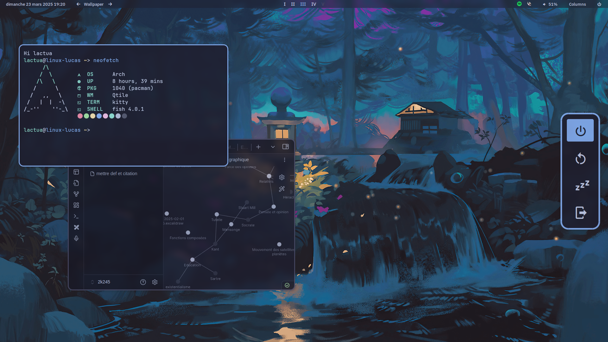

# Qtile dotfiles

**Important** : Big chance this dotfiles won't receive any updates.

This dotfiles contains configuration &/or theme for :
- cava
- dunst
- fonts
- gtk
- icons
- kitty
- neofetch
- picom
- qtile
- rofi
- vesktop
- wallpapers

## Screenshots


## Installation
### Dependencies
Install dependencies from `dependencies.txt`
```bash
cat dependencies.txt | paru -S --needed -
```

### Dotfiles
This repo uses [**GNU Stow**](https://www.gnu.org/software/stow/) to manage dotfiles.
Enter the dots directory and stow what you want to install with `~` as target (or everything)
```bash
cd dots
stow -t ~ *
```

## Configuration
**Important** : This dotfiles is initially made for azerty keyboards so by default on a qwerty keyboard the num keys won't work. This can be easly changed in dots/qtile/variables.py